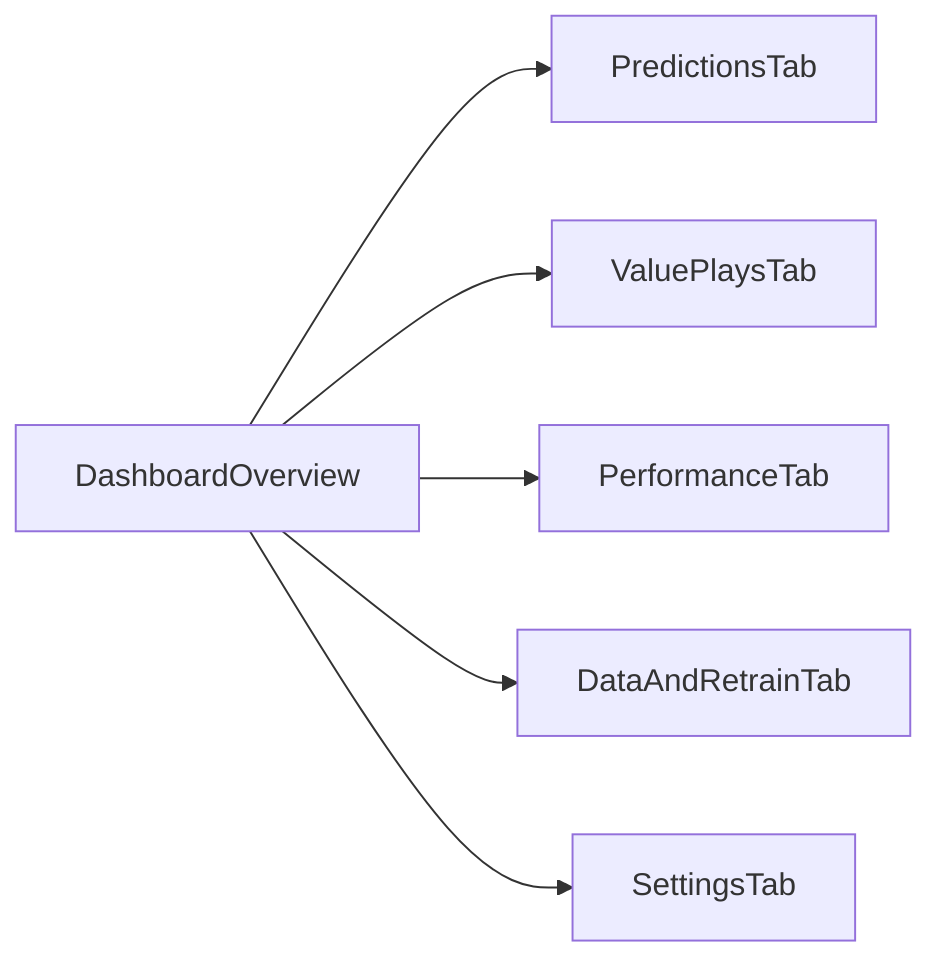

# UI/Frontend Modernization Roadmap

This roadmap upgrades the current Streamlit interface into a cleaner, app-like experience while keeping the existing model and data workflows stable.

## Goals

- Improve visual hierarchy and readability for daily decision-making.
- Make key actions obvious: predict, analyze value plays, review outcomes.
- Add richer charts and summaries without breaking current scripts.
- Keep each phase small and releasable.

## Current UX Gaps

- All functions are on one long page, which increases cognitive load.
- Tables are useful but not summarized by KPI cards.
- Value section and prediction section use different presentation styles.
- Performance/history insights are hard to scan quickly.

## Target Information Architecture

## Phase 1: Foundation and Layout

- Introduce top-level navigation with tabs/sections:
  - Overview
  - Predictions
  - Value Plays
  - Performance
  - Data + Retraining
- Standardize page spacing, section headings, and card layout.
- Add shared status area for:
  - last model train time
  - latest predictions timestamp
  - latest value-run timestamp.

## Phase 2: Data Presentation Upgrade

- Add KPI cards above tables:
  - predictions count
  - average confidence
  - value plays count
  - avg EV and avg stake %.
- Replace raw table-first flow with:
  - summary cards
  - quick chart
  - expandable detailed table.
- Add sorting defaults and filter chips (team/date/side/bookmaker).

## Phase 3: Visual Analytics

- Add confidence distribution chart for predictions.
- Add EV/edge scatter or bar chart for recommended plays.
- Add weekly accuracy trend chart from `data/weekly_summary.csv`.
- Add bankroll-impact simulation panel using suggested stake outputs.

## Phase 4: Interaction and Workflow Polish

- Convert key actions to guided flows:
  - Generate predictions
  - Resolve/score outcomes
  - Retrain from feedback
  - Run value analysis.
- Add empty-state guidance blocks with actionable next steps.
- Add non-blocking progress and success/error toasts with concise messages.

## Phase 5: Design System and Accessibility

- Define token-like constants (spacing, font sizes, semantic colors).
- Ensure color contrast and icon/text redundancy for confidence signals.
- Improve mobile/narrow width behavior for controls and tables.
- Add consistent number formatting (`%`, odds, currency) everywhere.

## Phase 6: Optional Next-Level Enhancements

- Introduce multi-page Streamlit app structure.
- Add user presets (bankroll, Kelly multiplier, table filters).
- Add export buttons (CSV snapshot, report summary).
- Add dark/light theme tuning and branding polish.

## Suggested Delivery Milestones

- Milestone A: Phase 1 + basic KPI cards from Phase 2.
- Milestone B: Complete Phase 2 + Phase 3 charts.
- Milestone C: Phase 4 workflow polish.
- Milestone D: Phase 5 accessibility + optional Phase 6 features.

## Definition of Done

- Navigation is task-based and easy to scan.
- Core screens provide summary + detail views.
- Users can complete prediction -> value -> scoring -> retraining workflow from UI.
- Visual clarity and consistency are materially better than the current baseline.
