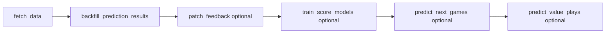

# Project pipeline and roadmap

Single reference for the data/ML pipeline, completed quality work, and remaining backlog.

## Completed: model quality sprint (archive)

The **2-week model quality sprint** (pre–data-growth) is implemented in the repo:

| Area | Where |
|------|--------|
| Feedback calibrator shadow metrics, `feedback_mode`, holdout shadow deltas | [`train_model.py`](../train_model.py) |
| Data quality snapshot and post-train drift vs previous run | [`train_model.py`](../train_model.py), surfaced in [`app.py`](../app.py) Performance |
| Headless feedback patch into saved bundle | [`train_model.patch_feedback_calibrator_into_artifacts`](../train_model.py) (used from [`prediction_sync.py`](../prediction_sync.py) on app startup; also available via `jobs/daily.py --patch-feedback`) |
| Calibration trend CSV, reliability bins, value backtest snapshot | [`score_predictions.py`](../score_predictions.py) |
| Performance UI: feedback mode, drift/quality warnings, calibration charts, value backtest | [`app.py`](../app.py) |

**Note:** Full `train_model.main()` writes richer `feedback_mode` / shadow delta fields than `patch_feedback_calibrator_into_artifacts` alone. After a headless patch, shadow-style metrics refresh on the next full train.

## Current pipeline (as-built)



- **`backfill_prediction_results.py`** runs `score_predictions` + feedback CSV build internally; **`--retrain`** forwards to full **`train_model.main()`** inside that script.
- **`jobs/daily.py`** orchestrates fetch, backfill, optional patch, score models, predictions, and value plays (see README §4b and [`pages/1_Automation.py`](../pages/1_Automation.py)).

## Automation (operator commands)

Recommended:

- **Typical night (light):** refresh data, score log, patch feedback into artifacts, refresh next-game predictions — use `--profile nightly` or the equivalent flags (see README).
- **Weekly / heavy:** add **`--retrain`** to the backfill step (full champion + calibrators); **`--patch-feedback` is skipped** when `--retrain` is set because training already refreshes artifacts.

Odds API: **`predict_value_plays`** needs **`ODDS_API_KEY`** (see [`.env.example`](../.env.example)). If the key is missing, `jobs/daily.py` logs a skip for the value step and continues with exit code 0.

## Quality / product backlog (not implemented)

Ideas from earlier planning that are **not** fully built yet:

- **Serve-time confidence policy** — e.g. cap or soften extreme probabilities when sample size or drift signals are weak (beyond calibration + shadow training).
- **Runtime drift monitoring** — ongoing distribution checks on recent predictions vs baseline, not only post-train `drift_warning` in `model_metrics.json`.
- **Feature attribution / “top drivers”** — auditable per-game drivers (SHAP-style or coefficient-based) for logistic paths.
- **Richer experiment tracking** — registry rows exist ([`retrain_from_feedback.py`](../retrain_from_feedback.py)); no full run config + gate snapshot per train yet.
- **Pipeline summary artifact** — structured JSON/Markdown of last `daily.py` run (step RCs, paths to metrics) for dashboards or alerts; today only append-only `logs/daily_pipeline.log`.

Treat the above as optional follow-ups unless prioritized.

## Smoke check

From repo root (with venv):

```bash
python jobs/daily.py --help
python -m pytest tests/test_daily_pipeline.py -q
```
